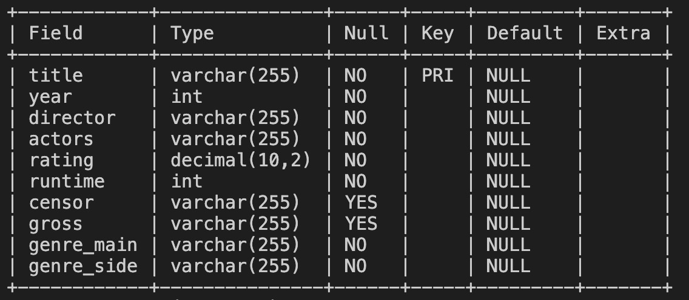
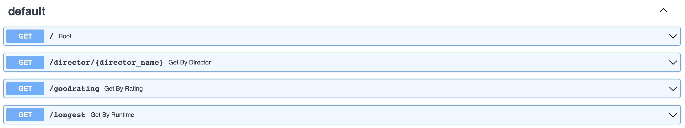

[](https://github.com/nogibjj/IDS706_Final_Project/actions/workflows/python-app.yml)

# IDS706_Final_Project

In this project, we implemented a microservice that enables users to query some useful information in our IMDb database. This project integrates relational databases, microservices, AWS services, and the CI/CD process. Users can send requests to our API to communicate with the microservices and the responses are in JSON format.

## Team

Chang Cao (cc749), Qiuchen Lei (ql110), Cirun Zhang (cz174), and Lanxin Zhang (lz202)

## Overview

This is the workflow diagram of our project. If contains several parts.

- Data source: Kaggle opensource dataset about IMDb movies
- Database: MySQL running on AWS RDS
- Microservices: FastAPI
- Docker registry: AWS ECR
- Deployment: AWS AppRunner
- CI/CD workflow: GitHub Actions


## Data Source and Database

Our data source is a Kaggle opensource dataset about [5000+ IMDb movies](https://www.kaggle.com/datasets/rakkesharv/imdb-5000-movies-multiple-genres-dataset). It includes movies from the early 1930s to current years. It contains several information such as years, directors, actors, ratings, etc. There are 10 columns in total.

We chose MySQL as our database and it was run on AWS RDS. Firstly, we used AWS RDS to set up our database named “imdb”. In order to access this database from our Codespaces in GitHub, we set publicly accessible as “yes”. Secondly, we chose a CSV file (“movie.csv”) from Kaggle and used SQL codes to create a table named “movie” in the database. Finally, we used a Python script to save all the information from the CSV file into our database. This is our table schema.



## Microservices

FastAPI is used as the microservices framework. The microservice has four functions.

- ```root()```: The welcome page
- ```get_by_director(director_name: str)```: Get all movies directed by one director
- ```get_by_rating()```: Get all movies with a high rating
- ```get_by_runtime()```: Get the top 10 longest movies.

Their corresponding URLs are:

- ```"/"```
- ```"/director/{director_name}"```
- ```"/goodrating"```
- ```"/longest"```

## Docker Registry

A local [Dockerfile](https://github.com/nogibjj/IDS706_Final_Project/blob/85fb8f40f4a30191bd60aa6a2d6ce387336bc681/Dockerfile) is used to build a Docker image for our project. After logging in to AWS, it is tagged and pushed to an AWS ECR repository. AWS ECR will register it there. These can be done automatically upon each push and pull request in the CI/CD workflow.

## Deployment

There is a AWS AppRunner service running constantly. It detects any change made to the ECR repository and will deploy the latest version. It provides users with a API gateway with a default domain.

## CI/CD

We used GitHub Actions to manage our CI/CD workflow. As for the CI part, there are several steps:

- Install dependencies.
- Lint source codes.
- Build a Docker image.
- Push the image to AWS ECR

For the CD part:

- AWS ECR registers the pushed image.
- AWS AppRunner detects changes and deploy the container.

## Usage

The domain name for our API gateway is https://rczbvajzqh.us-east-2.awsapprunner.com. Just use different URLs and specify different parameters to play with it! You can also refer to the Swagger docs for help.


